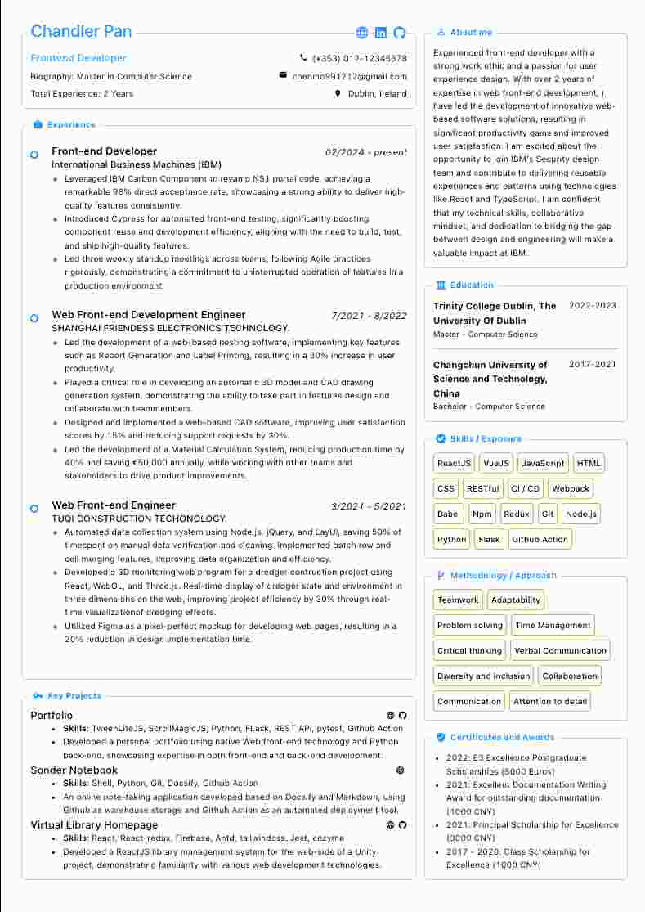
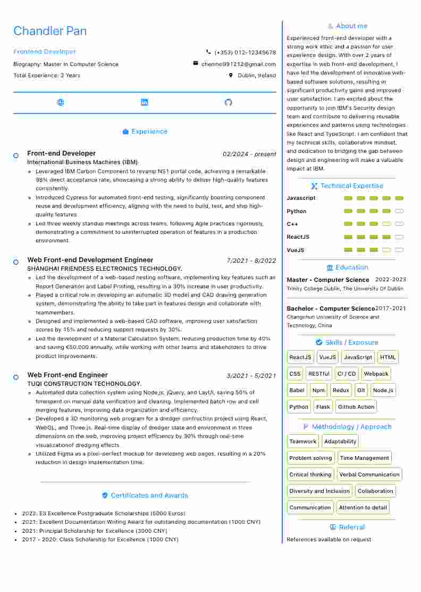

<h1>Single Page Resume Builder</h1>

### Free and open source, fully customizable professional single page resume builder

&nbsp;&nbsp;&nbsp;&nbsp;&nbsp;&nbsp;&nbsp;&nbsp;&nbsp;&nbsp;

👉 &nbsp;&nbsp;[Single Page Resume Builder](https://e-resume.vercel.app/)&nbsp;&nbsp;👈

- You Can Make Your Resume In This Format
  - Orientation: Portrait
  - Paper size: A4
  - Scale: Fit to width
  - Margins: None
  - Print headers & footers: Uncheck (remove tick mark)
  - Background/graphics: Check (add tick mark)

### Technologies

- [React](https://reactjs.org/) with hooks
- [Styled components](https://styled-components.com/) + [Antd](https://ant.design/docs/react/introduce) (css and component libraries)
- [Zustand](https://github.com/pmndrs/zustand) (hooks based state management library)
- [Next.js](https://nextjs.org/) (Bundler)

More features coming soon

---

## Architecture: Local-First Zero-DB

This project uses a **local-first, zero-server-database** architecture powered by [Dexie.js](https://dexie.org/) (IndexedDB wrapper).

### How Data is Stored
All user data lives **exclusively in your browser**:
- **Resumes**: Your CV data, edited sections, and AI-generated results
- **Jobs**: Job postings you've added
- **Tasks**: AI optimization task history and status
- **Prompt Templates**: Custom AI prompt overrides

No personal data is ever sent to or stored on the server. The backend processes AI requests ephemerally and discards all data when the request completes.

### BYOK (Bring Your Own Key)
Your AI provider API key is stored locally in your browser's localStorage only. It is sent directly to the backend as an `X-API-Key` header for the duration of the request, and never persisted server-side.

### Data Backup & Cross-Device Migration
Use **Settings → Data & Backup** to:
- **Export Backup**: Downloads all your data as a single `.json` file
- **Import Backup**: Restores data from a previously exported backup

To move data to another browser or device:
1. Export a backup on the source device
2. Transfer the `.json` file
3. Import the backup on the target device

### Technologies
| Layer | Technology |
|---|---|
| Local storage | [Dexie.js](https://dexie.org/) (IndexedDB) |
| State management | [Zustand](https://github.com/pmndrs/zustand) |
| AI integration | OpenAI / DeepSeek via backend |
|